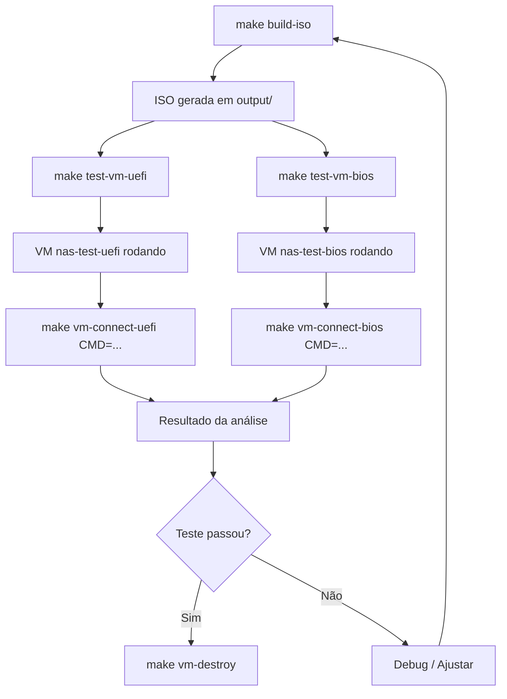

# Integração com o Projeto build-iso

Referência de como a infraestrutura virsh/libvirt se integra com os scripts, Makefile e fluxo de trabalho do projeto build-iso.

## Mapeamento: Makefile → Script → Comandos virsh

| Makefile Target          | Script                           | Comandos virsh Principais                                       |
| ------------------------ | -------------------------------- | --------------------------------------------------------------- |
| `make setup-vm`          | `vm-setup.sh`                    | (instala pacotes)                                               |
| `make test-vm-uefi`      | `vm-start-test-boot-iso.sh uefi` | `virsh list`, `virsh destroy`, `virsh undefine`, `virt-install` |
| `make test-vm-bios`      | `vm-start-test-boot-iso.sh bios` | (idem acima)                                                    |
| `make test-vm-all`       | `vm-start-test-all.sh`           | (orquestra as duas acima)                                       |
| `make vm-connect-uefi`   | `vm-connect-agent-llm.sh uefi`   | `virsh domifaddr`, `virsh domiflist`, `virsh net-dhcp-leases`   |
| `make vm-connect-bios`   | `vm-connect-agent-llm.sh bios`   | (idem acima)                                                    |
| `make vm-list`           | inline                           | `virsh list --all`                                              |
| `make vm-destroy`        | inline                           | `virsh destroy`, `virsh undefine`                               |
| `make vm-boot-disk-uefi` | `vm-start-test-boot-disk.sh`     | `virsh list`, `virsh destroy`, `virsh undefine`, `virt-install` |

## Arquivos e Diretórios Chave

```
scripts/vm/
├── vm-setup.sh                  # Instala dependências KVM
├── vm-start-test-boot-iso.sh    # Inicia VM com ISO + 4 discos
├── vm-start-test-boot-disk.sh   # Inicia VM a partir de disco instalado
├── vm-start-test-all.sh         # Testes UEFI + BIOS em paralelo
├── vm-connect-agent-llm.sh      # Conexão otimizada para agentes LLM
├── vm-connect-ssh.sh            # Conexão SSH com detecção automática
├── vm-connect-socket.sh         # Conexão serial via socket
├── README_VM.md                 # Documentação completa do framework
├── .cache/
│   └── vm-ips.env               # Cache de IPs detectados
└── disks/
    ├── uefi/                    # Discos para VM UEFI
    │   ├── disk1.qcow2
    │   ├── disk2.qcow2
    │   ├── disk3.qcow2
    │   └── disk4.qcow2
    └── bios/                    # Discos para VM BIOS
        ├── disk1.qcow2
        ├── disk2.qcow2
        ├── disk3.qcow2
        └── disk4.qcow2
```

## Fluxo Completo de Teste



## Convenções do Projeto

### Nomes de VMs

| VM               | Firmware     | Socket Serial              |
| ---------------- | ------------ | -------------------------- |
| `nas-test-uefi`  | UEFI (OVMF)  | `/tmp/nas-test-uefi.sock`  |
| `nas-test-bios`  | Legacy BIOS  | `/tmp/nas-test-bios.sock`  |
| `disk-boot-uefi` | UEFI (disco) | `/tmp/disk-boot-uefi.sock` |
| `disk-boot-bios` | BIOS (disco) | `/tmp/disk-boot-bios.sock` |

### Hostname Dinâmico

```
debian-trixie-zbm-<tipo>-<firmware>
```

| Componente | Valores Possíveis         | Detecção              |
| ---------- | ------------------------- | --------------------- |
| tipo       | `kvm`, `qemu`, `physical` | `systemd-detect-virt` |
| firmware   | `uefi`, `bios`            | Parâmetro do script   |

Exemplos: `debian-trixie-zbm-kvm-uefi`, `debian-trixie-zbm-kvm-bios`

### Cache de Estado

Arquivo: `scripts/vm/.cache/vm-ips.env`

```bash
VM_IP_UEFI=192.168.122.45
VM_IP_BIOS=192.168.122.67
```

### Configuração de VM Padrão

| Recurso      | Valor                          |
| ------------ | ------------------------------ |
| RAM          | 4096 MB (4G)                   |
| vCPUs        | 2                              |
| Discos NAS   | 4 × 10GB QCOW2 (virtio)        |
| Rede         | `default` (NAT, modelo virtio) |
| Gráficos     | SPICE                          |
| OS Variant   | `debian12`                     |
| Persistência | `--transient` (não persiste)   |

## Padrões de Código nos Scripts

### Idempotência

Todos os scripts de criação de VM seguem o padrão destroy + undefine antes de criar:

```bash
if virsh --connect qemu:///system list --all --name | grep -q "^${VM_NAME}$"; then
  virsh --connect qemu:///system destroy "$VM_NAME" >/dev/null 2>&1 || true
  virsh --connect qemu:///system undefine "$VM_NAME" --nvram >/dev/null 2>&1 || true
fi
```

### Detecção de IP Multicamada

```
Fast-path: virsh domifaddr (direto)
    ↓ falha
Fallback 1: MAC matching via net-dhcp-leases
    ↓ falha
Fallback 2: Cache em .cache/vm-ips.env
```

### Bootstrap SSH Multicamada

```
1. Verificar chave SSH local (gerar se necessário)
2. Carregar IP do cache
3. Detectar IP (se não cacheado)
4. Testar SSH (se IP disponível)
5. Copiar chave via sshpass (se SSH não autenticado)
6. Fallback serial: injetar chave via socket unix
```

## Protocolo de Diagnóstico para Agentes

Sequência recomendada para agentes LLM analisarem VMs:

```bash
# 1. Verificar estado
make vm-list

# 2. Testar conectividade
make vm-connect-uefi CMD="echo ok && hostname"

# 3. Inspecionar armazenamento
make vm-connect-uefi CMD="lsblk -f"
make vm-connect-uefi CMD="zpool status 2>/dev/null || echo 'Sem ZFS pool'"

# 4. Verificar sistema
make vm-connect-uefi CMD="uname -a && cat /etc/os-release | head -5"

# 5. Logs de erro
make vm-connect-uefi CMD="journalctl -p err -n 30 --no-pager"

# 6. Rede
make vm-connect-uefi CMD="ip addr show && ip route"

# 7. Módulos ZFS
make vm-connect-uefi CMD="lsmod | grep zfs && modinfo zfs | head -5"
```

## Variáveis de Ambiente do Framework

| Variável                | Padrão           | Descrição                             |
| ----------------------- | ---------------- | ------------------------------------- |
| `VM_CMD`                | (obrigatório)    | Comando para execução remota          |
| `VM_IP`                 | (auto-detectado) | IP explícito da VM                    |
| `SSH_USER`              | `root`           | Usuário SSH                           |
| `VM_SSH_PASSWORD`       | `x`              | Senha para bootstrap                  |
| `AUTO_BOOTSTRAP_SSH`    | `true`           | Bootstrap automático                  |
| `VM_LIVE_BOOT_WAIT`     | `30`             | Espera inicial de boot (segundos)     |
| `VM_IP_DETECT_ATTEMPTS` | `6`              | Tentativas de detecção de IP          |
| `VM_IP_DETECT_INTERVAL` | `1`              | Intervalo entre tentativas (segundos) |
| `VM_DHCP_TIMEOUT`       | `12`             | Timeout DHCP (conector legado)        |
| `FORCE_NONINTERACTIVE`  | `0`              | Modo não-interativo                   |
