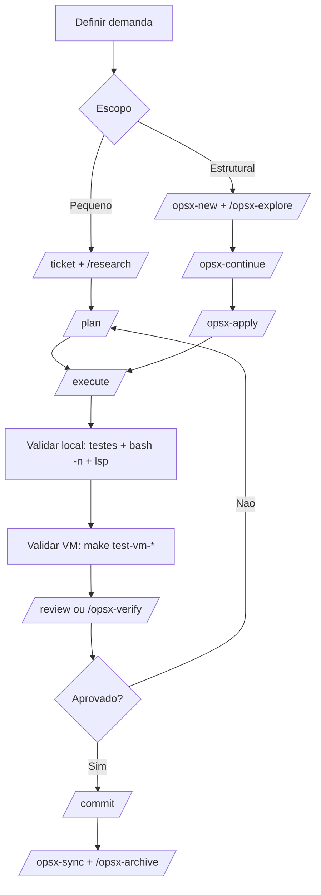
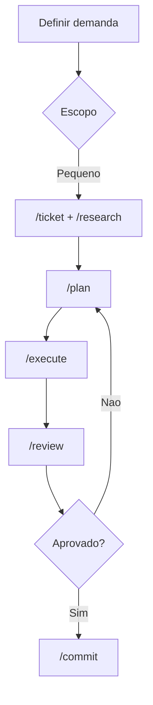
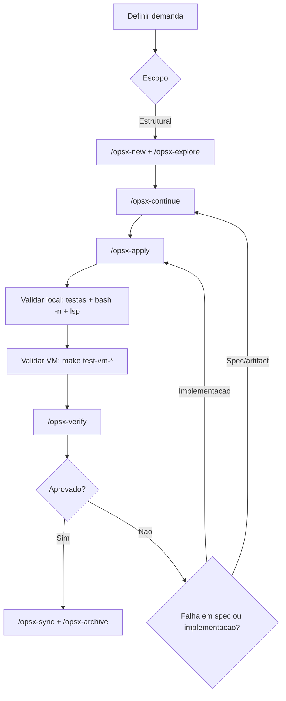
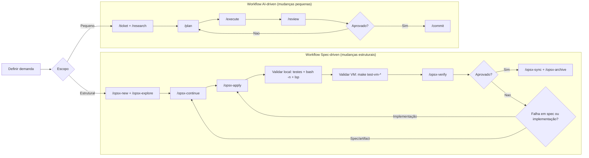
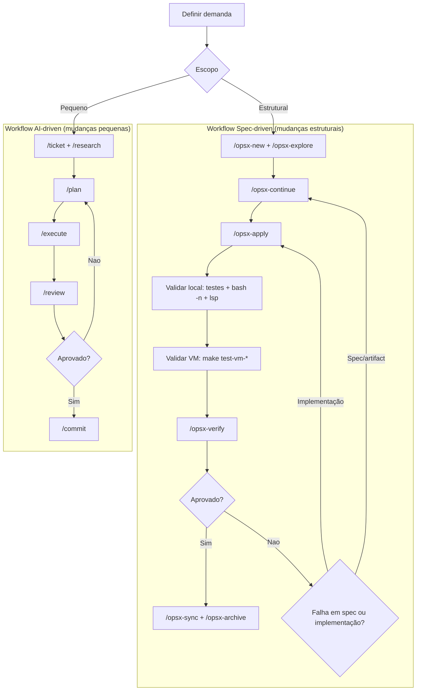
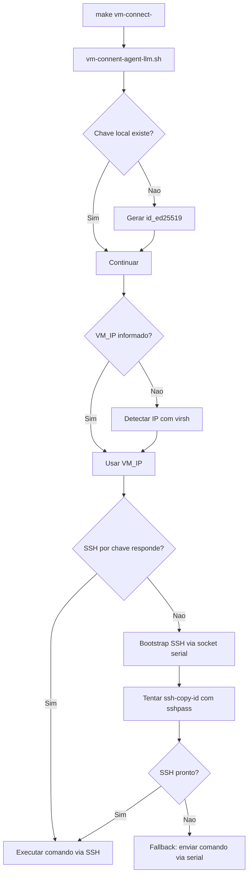

# Workflow AI-Driven e Spec-Driven

## Objetivo

Este guia documenta um fluxo operacional padrao para colaboradores e agentes LLM trabalharem no projeto com:

- previsibilidade (passos claros e repetiveis);
- automacao de build/teste/conexao em VM;
- rastreabilidade por especificacao (OpenSpec);
- execucao nao interativa (ideal para agentes com menor capacidade de inferencia).

---

## Ferramentas de Workflow Disponiveis

### 1) Interface de automacao do projeto (Makefile + scripts)

Use quando o foco for **build, boot de VM, conexao e validacao tecnica**.

- `make build-iso`
- `make test-vm-uefi`
- `make test-vm-bios`
- `make test-vm-all`
- `make vm-connect-uefi`
- `make vm-connect-bios`

Script-chave para agentes:

- `scripts/vm/vm-connent-agent-llm.sh`

### 2) Workflow AI-driven (OpenCode commands)

Use quando o foco for **ciclo de engenharia assistida por IA** (ticket -> pesquisa -> plano -> execucao -> revisao).

- `/ticket`
- `/research`
- `/plan`
- `/execute`
- `/review`
- `/commit`

### 3) Workflow Spec-driven (OpenSpec experimental)

Use quando o foco for **mudanca orientada por artefatos de especificacao**.

- `/opsx-new`
- `/opsx-explore`
- `/opsx-continue`
- `/opsx-apply`
- `/opsx-verify`
- `/opsx-sync`
- `/opsx-archive`

Regra pratica:

- Mudanca pequena/corretiva: AI-driven pode ser suficiente.
- Mudanca estrutural/multietapa: priorize Spec-driven com OpenSpec.

---

## Fluxo Recomendado de Desenvolvimento



- No fluxo AI-driven, seu loop Não -> /plan está correto (replaneja e executa de novo).



- No fluxo Spec-driven, o Não precisa decidir se o problema é:
  - de especificação/artifacts -> volta para /opsx-continue
  - de implementação -> volta para /opsx-apply







---

## Fluxo de Conectividade para Agentes LLM (Nao Interativo)

O alvo `make vm-connect-bios` e `make vm-connect-uefi` usa `vm-connent-agent-llm.sh` como gateway.

Esse gateway automatiza:

1. Geracao de chave SSH local (`~/.ssh/id_ed25519`) se nao existir.
2. Descoberta de IP por `virsh` quando `VM_IP` nao for informado.
3. Bootstrap via serial socket da VM:
   - cria `~root/.ssh/authorized_keys`;
   - habilita `PermitRootLogin yes`;
   - habilita `PasswordAuthentication yes`;
   - define senha root como `x` (ambiente live/lab);
   - reinicia `ssh`.
4. Tentativa de `ssh-copy-id` com `sshpass` (se instalado).
5. Execucao por SSH; se indisponivel, fallback serial automatizado.



---

## Comandos Padrao para Agentes

### Bootstrap completo de ambiente

```bash
make setup-vm
make download-zbm
make setup-docker
make build-iso
```

### Subir VM de teste

```bash
make test-vm-bios
# ou
make test-vm-uefi
# ou
make test-vm-all
```

### Executar validacao remota nao interativa

Com IP explicito (mais estavel para automacao):

```bash
make vm-connect-bios VM_IP=192.168.100.207 VM_CMD="uname -a && lsblk -f"
```

Sem IP explicito (autodescoberta via `virsh`):

```bash
make vm-connect-bios VM_CMD="journalctl -p 3 -n 80"
```

### Exemplo de checks padrao de bugfix

```bash
make vm-connect-bios VM_IP=192.168.100.207 VM_CMD="bash -n /usr/local/bin/installer"
make vm-connect-bios VM_IP=192.168.100.207 VM_CMD="/usr/local/bin/installer --print-map"
make vm-connect-bios VM_IP=192.168.100.207 VM_CMD="ip -4 -o addr show"
```

---

## Como Manter o Workflow Eficiente

1. Sempre prefira comandos nao interativos (`VM_CMD=...`, `BatchMode=yes`, scripts idempotentes).
2. Use `VM_IP` explicito em CI/local quando possivel para reduzir ambiguidades de rede.
3. Separe ciclo em tres fases curtas:
   - especificacao (AI/spec-driven),
   - implementacao local,
   - verificacao em VM.
4. Em correcoes de bug, aplique mudanca minima e valide com comando objetivo na VM.
5. Mantenha evidencias de validacao no PR/relatorio (comandos executados + resultado).

---

## Reconstrucao do Ambiente (Disaster Recovery)

Quando o ambiente estiver inconsistente, use este reset rapido:

```bash
make clean
make setup-vm
make download-zbm
make setup-docker
make build-iso
make test-vm-bios
```

Se a conexao da VM falhar:

1. Verifique VMs ativas:

```bash
make vm-list
```

2. Recrie apenas VM de teste:

```bash
make vm-destroy
make test-vm-bios
```

3. Reforce bootstrap de conectividade para agente:

```bash
make vm-connect-bios VM_CMD="echo ready && hostname"
```

---

## Seguranca (Ambiente de Teste)

- A senha root `x` e a habilitacao de `PasswordAuthentication yes` sao aceitaveis apenas em ambiente de laboratorio/live.
- Para ambientes mais sensiveis, apos validacao, reverta para acesso por chave:

```bash
make vm-connect-bios VM_CMD="sed -i 's/^PasswordAuthentication.*/PasswordAuthentication no/' /etc/ssh/sshd_config && systemctl restart ssh"
```

---

## Referencias Internas

- `scripts/vm/vm-connent-agent-llm.sh`
- `scripts/vm/vm-connent-ssh.sh`
- `scripts/vm/README_VM.md`
- `docs/PROJECT_STRUCTURE.md`
- `docs/INSTALLER_JUNIOR_PLAYBOOK.md`
- `AGENTS.md`
