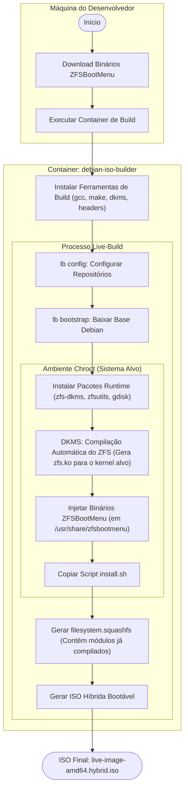
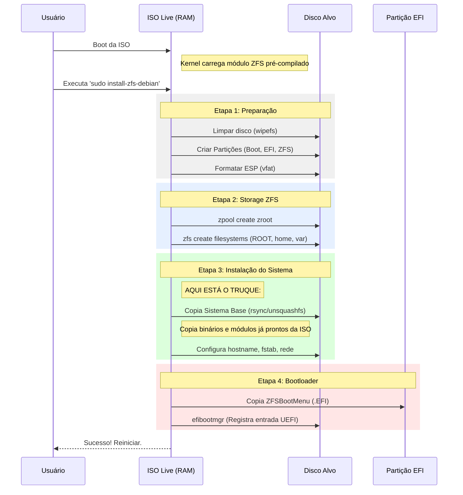

# Arquitetura de Build e Instalação Offline do Debian ZFS

**Versão:** 1.0  
**Data:** 06/01/2026  
**Projeto:** build-iso

---

## 1. Conceito e Estratégia

Este documento descreve a estratégia técnica para criar uma imagem ISO do Debian (Live) que suporte **ZFS-on-Root** nativamente, eliminando a necessidade de compilação ou acesso à internet durante a instalação final.

### O Problema

O OpenZFS não pode ser distribuído pré-compilado diretamente no kernel Linux devido a incompatibilidades de licença (CDDL vs GPL). Tradicionalmente, isso obriga o instalador a:

1. Baixar o código-fonte (requer internet).
2. Instalar compiladores (`gcc`, `make`, `linux-headers`).
3. Compilar os módulos (DKMS) durante a instalação (lento e consome CPU).

### A Solução: "Build Factory" em Docker

Nossa abordagem move a complexidade da **compilação** para a etapa de **construção da ISO**, utilizando um container Docker como uma "fábrica limpa".

1. **Ambiente de Build (Docker):** Contém todas as ferramentas pesadas de desenvolvimento (`build-essential`, `devscripts`, `headers`).
2. **Processo de Build:** A ISO é gerada e, durante o processo (`chroot`), os módulos ZFS são compilados e instalados no sistema de arquivos da imagem.
3. **Produto Final (ISO):** Contém os módulos já binários (`.ko`) e um instalador leve. Não possui compiladores.
4. **Instalação (Target):** O script apenas copia o sistema já pronto para o disco e configura o bootloader. **Zero compilação no cliente.**

---

## 2. Fluxo de Construção (Pipeline)

O processo é automatizado via `scripts/build-iso-in-docker.sh` e `live-build`.



---

## 3. Matriz de Componentes

Diferenciação clara entre o que é necessário para _construir_ e o que vai na _mídia final_.

| Categoria        | Pacotes no Docker (Build Factory)      | Pacotes na ISO Final (Runtime)      | Motivo                                                                           |
| :--------------- | :------------------------------------- | :---------------------------------- | :------------------------------------------------------------------------------- |
| **Kernel**       | `linux-headers-amd64`                  | `linux-image-amd64`                 | Headers são necessários apenas para compilar o módulo.                           |
| **ZFS**          | `zfs-dkms`, `dkms`                     | `zfsutils-linux`, `libzfs*`         | O módulo `.ko` gerado é persistido; o código-fonte pode ser removido (opcional). |
| **Compiladores** | `build-essential`, `gcc`, `make`       | _Nenhum_                            | Economia de espaço e segurança (reduz superfície de ataque).                     |
| **Ferramentas**  | `live-build`, `xorriso`, `debootstrap` | `gdisk`, `dosfstools`, `efibootmgr` | Ferramentas de build vs. Ferramentas de particionamento/boot.                    |
| **Bootloader**   | `wget`, `curl` (para baixar ZBM)       | `zfsbootmenu` (binários)            | O ZBM é baixado antes e apenas copiado para a ISO.                               |

---

## 4. Fluxo de Instalação (Instalador Live)

O script `/usr/local/bin/install-zfs-debian` (acessível via `install-system`) executa a instalação no hardware do usuário.



---

## 5. Estrutura de Diretórios Chave

### 5.1 No Repositório (Host)

```bash
/
├── docker/
│   └── Dockerfile          # Define a "Fábrica": instala compiladores e live-build
├── config/
│   ├── package-lists/
│   │   ├── tools.list.chroot  # Ferramentas leves para a ISO (gdisk, ssh)
│   │   └── zfs.list.chroot    # Pacotes ZFS (dkms é executado no chroot)
│   └── includes.chroot/       # Arquivos injetados diretamente na ISO
│       ├── usr/local/bin/install-zfs-debian  # O script instalador
│       └── usr/share/zfsbootmenu/            # Binários do bootloader
└── scripts/
    ├── build-iso-in-docker.sh # Orquestrador principal
    └── download-zfsbootmenu.sh # Pré-requisito: baixa ZBM
```

### 5.2 Na ISO Final (Resultado)

```bash
/ (root)
├── live/
│   ├── vmlinuz             # Kernel Debian padrão
│   ├── initrd.img          # Initramfs padrão
│   └── filesystem.squashfs # O SO completo (com módulos ZFS dentro)
├── usr/local/bin/
│   └── install-zfs-debian  # Script para instalar no disco
└── usr/share/zfsbootmenu/
    ├── vmlinuz-bootmenu    # Kernel do Bootloader ZBM
    └── initramfs-bootmenu  # Initramfs do Bootloader ZBM
```

## 6. Vantagens da Abordagem

1. **Confiabilidade:** O build ocorre em um ambiente Docker controlado e imutável. Se funciona na máquina do desenvolvedor A, funciona na B.
2. **Velocidade de Instalação:** O usuário final não compila nada. A instalação é limitada apenas pela velocidade de escrita no disco.
3. **Instalação Offline:** Não requer internet no cliente para baixar headers ou compiladores.
4. **Tamanho Reduzido:** A ISO não carrega gigabytes de ferramentas de desenvolvimento (`gcc`, `make`, headers não utilizados), apenas o resultado do build.
