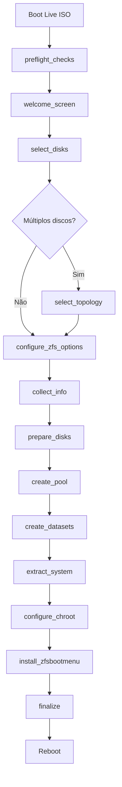

# Aurora OS Installer - Arquitetura e Abordagem Técnica

> **Documento de Referência Permanente**
> Última atualização: 2026-01-07

## Visão Geral

Este documento descreve a arquitetura e abordagem técnica do instalador **Aurora OS**, um instalador avançado para Debian com ZFS-on-Root e ZFSBootMenu.

## Decisões de Design

### 1. Extração do Sistema: unsquashfs (não rsync)

**Decisão:** Usar `unsquashfs` como método primário de extração do sistema.

**Justificativa:**

| Aspecto       | unsquashfs       | rsync                    |
| ------------- | ---------------- | ------------------------ |
| Velocidade    | 2-3x mais rápido | Mais lento               |
| Consistência  | Imagem imutável  | Varia com estado do Live |
| Arquivos temp | Não copia        | Pode copiar              |
| Offline       | ✅ Sim            | ✅ Sim                    |

**Implementação:**

```bash
extract_system() {
    local squashfs_path="/run/live/medium/live/filesystem.squashfs"

    [[ -f "$squashfs_path" ]] || error_exit "squashfs não encontrado em $squashfs_path"

    gum spin --title "Extraindo sistema..." -- \
        unsquashfs -f -d "$MOUNT_POINT" "$squashfs_path"
}
```

**Referência:** Esta é a mesma abordagem usada pelo instalador oficial do Proxmox VE.

---

### 2. Bootloader: ZFSBootMenu (não GRUB)

**Decisão:** Usar ZFSBootMenu ao invés de GRUB ou systemd-boot.

**Justificativa:**

- Gerenciamento nativo de snapshots ZFS
- Boot direto de qualquer dataset
- Rollback fácil para snapshots anteriores
- Suporte a criptografia nativa ZFS

---

### 3. Instalação Offline (não debootstrap)

**Decisão:** Não usar debootstrap durante a instalação.

**Justificativa:**

- debootstrap requer conexão com a internet
- Compilação DKMS do ZFS requer headers e tempo
- Nossa ISO já contém o sistema completo pré-compilado

**Fluxo:**

```shell
Build da ISO (com internet)
    └── Hook DKMS compila módulos ZFS
    └── Sistema completo em filesystem.squashfs

Instalação (sem internet)
    └── unsquashfs extrai sistema pronto
    └── ZFS já funcional
```

---

### 4. Opções ZFS Avançadas (estilo Proxmox)

**Decisão:** Oferecer todas as opções ZFS disponíveis no instalador Proxmox.

| Opção       | Descrição        | Valores                 | Padrão |
| ----------- | ---------------- | ----------------------- | ------ |
| ashift      | Tamanho do setor | 9, 12, 13, 14           | 12     |
| compression | Algoritmo        | off, lz4, zstd, gzip    | zstd   |
| checksum    | Algoritmo        | on, sha256, sha512, off | on     |
| copies      | Redundância      | 1, 2, 3                 | 1      |

---

### 5. Suporte a RAID-Z

**Decisão:** Suporte completo a múltiplos discos e topologias RAID.

| Discos | Topologias Disponíveis |
| ------ | ---------------------- |
| 1      | Single                 |
| 2      | Mirror, Stripe         |
| 3+     | RAIDZ1                 |
| 4+     | RAIDZ2                 |
| 5+     | RAIDZ3                 |

---

### 6. Criptografia Nativa ZFS

**Decisão:** Utilizar criptografia nativa do OpenZFS (AES-256-GCM) com passphrase.

**Benefícios:**

- Proteção de dados em repouso
- Integração profunda com snapshots (podem ser replicados criptografados)
- Performance superior a LUKS no ZFS

---

### 7. Perfis de Instalação (Server vs Workstation)

| Perfil          | Descrição                       | Ambiente Base                       |
| --------------- | ------------------------------- | ----------------------------------- |
| **Server**      | Foco em serviços e estabilidade | CLI-only, ferramentas de rede       |
| **Workstation** | Foco em produtividade           | KDE Plasma minimalista, Docker, Git |

---

### 8. Interface TUI: Gum

**Decisão:** Usar Gum para interface TUI ao invés de dialog/whiptail.

**Justificativa:**

- Visual moderno e atraente
- Fácil de usar em scripts Bash
- Suporte a cores e estilos
- Mantido ativamente (Charm.sh)

---

## Arquitetura do Instalador

```bash
install-aurora.sh
│
├── Módulo: Logging
│   ├── log()
│   └── error_exit()
│
├── Módulo: Pré-requisitos
│   └── preflight_checks()
│       ├── Verificar root
│       ├── Carregar módulo ZFS
│       └── Verificar memória
│
├── Módulo: Interface TUI
│   ├── welcome_screen()
│   ├── select_disks()
│   ├── select_topology()
│   ├── select_profile()
│   ├── configure_encryption()
│   ├── configure_zfs_options()
│   └── collect_info()
│
├── Módulo: Preparação do Disco
│   └── prepare_disks()
│       ├── wipefs
│       ├── sgdisk (partições GPT)
│       └── partprobe
│
├── Módulo: ZFS
│   ├── create_pool()
│   ├── create_datasets()
│   └── setup_encryption()
│
├── Módulo: Sistema Base
│   └── extract_system()
│       └── unsquashfs (obrigatório)
│
├── Módulo: Configuração Chroot
│   ├── mount_chroot_filesystems()
│   └── configure_chroot()
│       ├── Hostname
│       ├── Usuários (root + admin)
│       ├── Locales (pt_BR)
│       ├── Initramfs
│       └── Profile Setup (Server/Workstation)
│
├── Módulo: ZFSBootMenu
│   └── install_zfsbootmenu()
│       ├── Formatar ESP
│       ├── Copiar binários
│       └── Configurar EFI
│
└── Módulo: Finalização
    └── finalize()
        ├── Snapshot inicial
        ├── Desmontar filesystems
        └── Exportar pool
```

---

## Referências Técnicas

### Projetos Analisados

1. **[pve-zol](https://github.com/stackcoder/pve-zol)** - Base principal
   
   - Script Bash para Debian
   - debootstrap + chroot
   - Suporte a múltiplos discos

2. **[Proxmox VE Installer](https://github.com/proxmox/pve-installer)** - Referência para opções ZFS
   
   - Opções ashift, hdsize, compression
   - Topologias RAID-Z

3. **[OpenZFS Debian Root on ZFS](https://openzfs.github.io/openzfs-docs/)** - Documentação oficial
   
   - Hierarquia de datasets
   - Configuração de boot

4. **[Calamares ZFS Integration](https://github.com/wlfogle/calamares-zfs-integration)** - Referência futura
   
   - Módulos Python para GUI
   - Post-installation hooks

---

## Diagrama de Fluxo



---

## Changelog

| Data       | Mudança                     |
| ---------- | --------------------------- |
| 2026-01-07 | Documento criado            |
| 2026-01-07 | Decisão: unsquashfs > rsync |
| 2026-01-07 | Adicionado suporte RAID-Z   |
| 2026-01-07 | Opções ZFS estilo Proxmox   |
