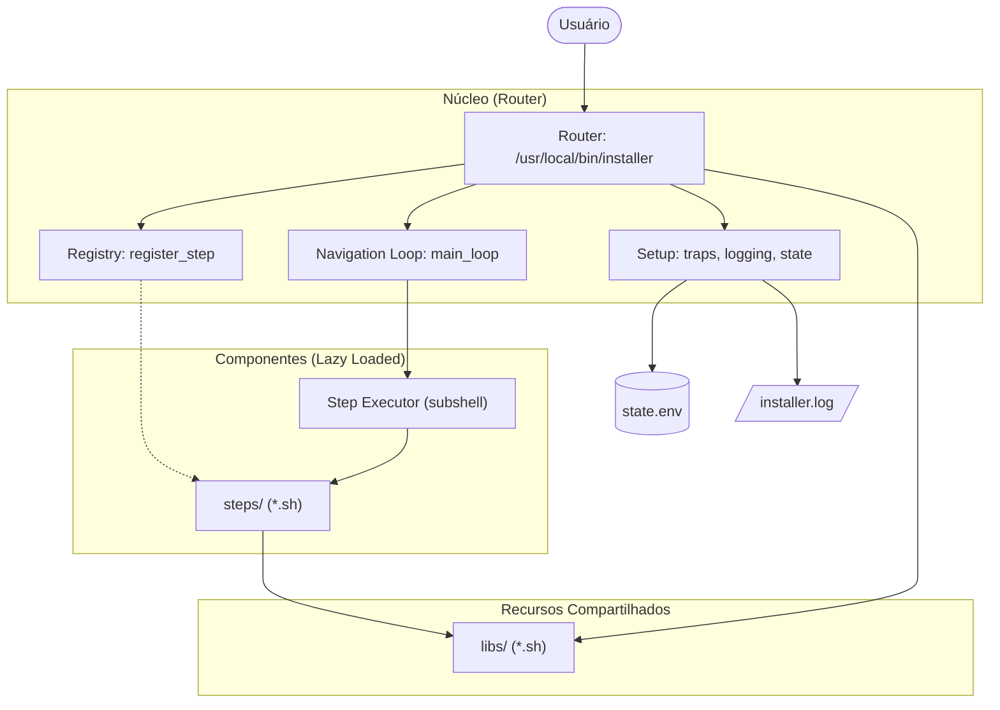
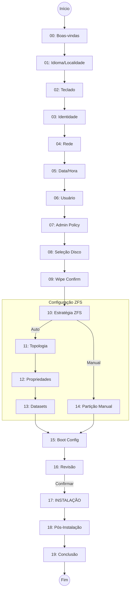
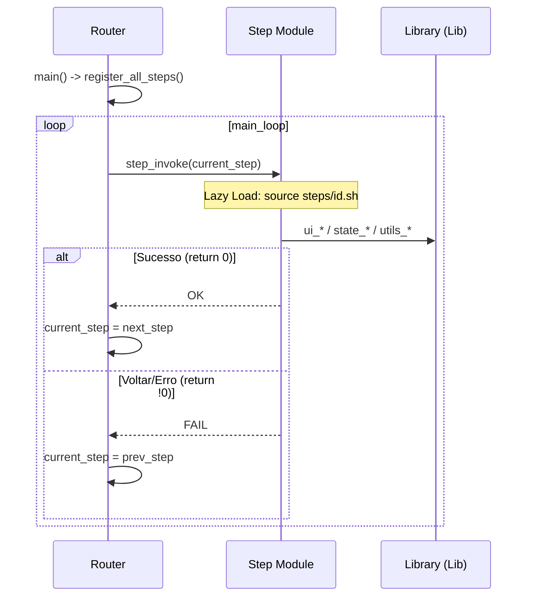

# Arquitetura Técnica do Instalador Modular

Este documento detalha o fluxo de execução, a estrutura de componentes e as dependências do instalador modular do projeto **FILESERVER**.

---

## 1. Visão Geral da Arquitetura

O instalador segue uma arquitetura baseada em um **Router Central** que utiliza *Lazy Loading* para carregar módulos de etapas (*steps*) e bibliotecas de utilitários (*libs*).

```mermaid
graph TD
    User([Usuário]) --> Router[Router: /usr/local/bin/installer]
    
    subgraph "Núcleo (Router)"
        Router --> Setup[Setup: traps, logging, state]
        Router --> Registry[Registry: register_step]
        Router --> Loop[Navigation Loop: main_loop]
    end

    subgraph "Componentes (Lazy Loaded)"
        Registry -.-> StepsDir["steps/ (*.sh)"]
        Loop --> StepModule["Step Executor (subshell)"]
        StepModule --> StepsDir
    end

    subgraph "Recursos Compartilhados"
        StepsDir --> LibsDir["libs/ (*.sh)"]
        Router --> LibsDir
    end

    Setup --> StateFile[(state.env)]
    Setup --> LogFile[/installer.log/]
```

---

## 2. Fluxo de Execução (Sequencial)

O instalador é composto por 20 etapas lógicas. A navegação permite avançar ou retroceder (quando aplicável).

```mermaid
flowchart TD
    Start((Início)) --> S00[00: Boas-vindas]
    S00 --> S01[01: Idioma/Localidade]
    S01 --> S02[02: Teclado]
    S02 --> S03[03: Identidade]
    S03 --> S04[04: Rede]
    S04 --> S05[05: Data/Hora]
    S05 --> S06[06: Usuário]
    S06 --> S07[07: Admin Policy]
    S07 --> S08[08: Seleção Disco]
    S08 --> S09[09: Wipe Confirm]
    S09 --> S10[10: Estratégia ZFS]
    
    subgraph "Configuração ZFS"
        S10 -- Auto --> S11[11: Topologia]
        S11 --> S12[12: Propriedades]
        S12 --> S13[13: Datasets]
        S10 -- Manual --> S14[14: Partição Manual]
    end

    S13 --> S15[15: Boot Config]
    S14 --> S15
    S15 --> S16[16: Revisão]
    S16 -- "Confirmar" --> S17[17: INSTALAÇÃO]
    S17 --> S18[18: Pós-Instalação]
    S18 --> S19[19: Conclusão]
    S19 --> End((Fim))
```

---

## 3. Matriz de Dependências (Módulos vs. Bibliotecas)

As bibliotecas em `libs/` fornecem as funções de baixo nível utilizadas pelos módulos em `steps/`.

| Biblioteca | Responsabilidade | Utilizado em (Exemplos) |
| :--- | :--- | :--- |
| `ui-utils.sh` | Elementos Visuais (Design System v2.0), Spinners | Todas as etapas |
| `core-utils.sh` | Logging, Sanitização, Saída de erro | Todas as etapas |
| `state-utils.sh` | Persistência KV (salvar/carregar variáveis) | Todas as etapas |
| `disk-utils.sh` | Listagem de discos, wipe, particionamento GPT | `disk_select`, `install` |
| `zfs-utils.sh` | Criação de pools, datasets, propriedades ZFS | `zfs_*`, `install` |
| `net-utils.sh` | Configuração DHCP e IP Estático | `network`, `post_install` |
| `auth-utils.sh` | Criação de usuários, senhas (chpasswd) | `user_account`, `post_install` |
| `boot-utils.sh` | Detecção UEFI/BIOS, montagem de ESP | `boot`, `install`, `post_install` |
| `zbm-install.sh` | Instalação e configuração do ZFSBootMenu | `post_install` |

---

## 4. Gestão de Estado (KV Store)

O estado da instalação é persistido em `/var/run/installer/state.env` (ou localmente em ambiente de teste).

| Chave (Key) | Descrição | Origem (Step) |
| :--- | :--- | :--- |
| `install_disk` | Caminho do disco alvo (ex: `/dev/sda`) | `disk_select` |
| `zfs_pool_name` | Nome do pool ZFS (default: `zroot`) | `zfs_strategy` |
| `install_net_method` | `dhcp` ou `manual` | `network` |
| `install_username` | Nome curto do usuário inicial | `user_account` |
| `install_admin_policy` | `sudo` ou `root` (política de privilégios) | `admin_policy` |
| `install_part_efi` | Caminho da partição EFI detectada/criada | `install` |

---

## 5. Lógica Interna de Navegação (Router)

O Router utiliza um loop de controle que decide a próxima etapa baseado no código de retorno (`exit code`) da função do step.

```mermaid
sequenceDiagram
    participant R as Router
    participant S as Step Module
    participant L as Library (Lib)

    R->>R: main() -> register_all_steps()
    loop main_loop
        R->>S: step_invoke(current_step)
        Note over S: Lazy Load: source steps/id.sh
        S->>L: ui_* / state_* / utils_*
        alt Sucesso (return 0)
            S-->>R: OK
            R->>R: current_step = next_step
        else Voltar/Erro (return !0)
            S-->>R: FAIL
            R->>R: current_step = prev_step
        end
    end
```

---

> [!TIP]
> Para depuração, utilize a flag `--print-map` no instalador para visualizar a tabela de rotas e conexões entre steps e handlers.
