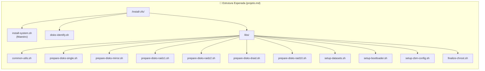
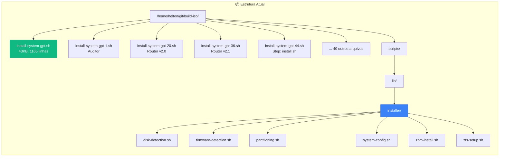
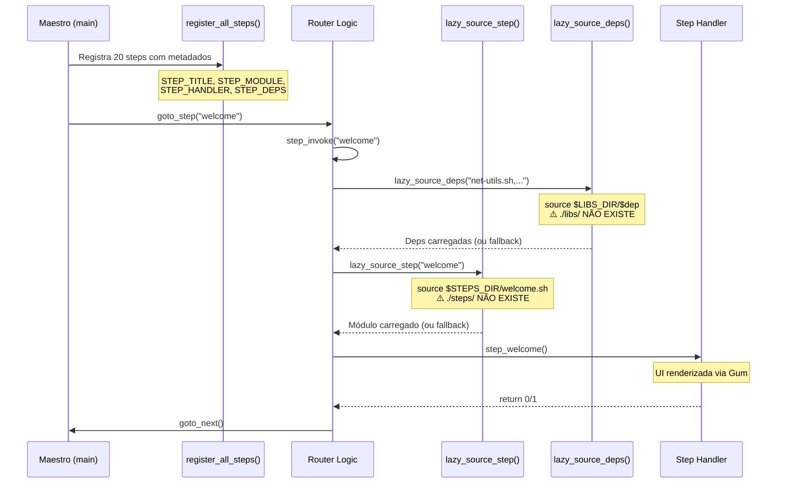
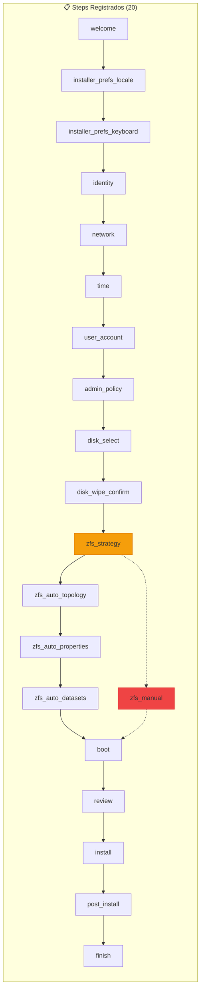
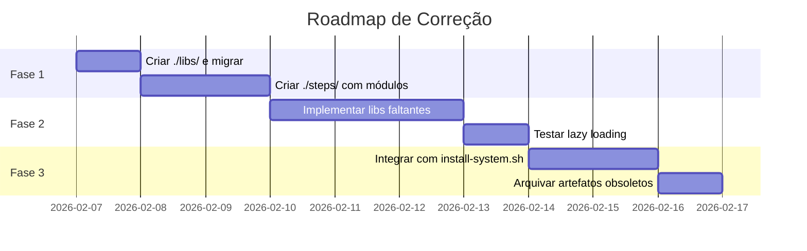

# Auditoria Técnica: Instalador GPT com Lazy Loading

**Data:** 2026-02-07
**Status:** ~~Em Execução~~ → **Superseded**
**Autor:** Antigravity AI

> [!WARNING]
> **Plano superseded.** O instalador foi refatorado com `gum` e a arquitetura de `libs/` e `steps/` está implementada em
> `config-overrides/config/includes.chroot/usr/local/lib/installer/`. Consulte
> [`docs/INSTALLER_ARCHITECTURE.md`](../docs/INSTALLER_ARCHITECTURE.md) para a arquitetura atual.

## Descrição do Problema

A implementação anterior do instalador, embora tenha buscado uma abordagem modular com **Lazy Loading em Shell Script**, apresenta desvios significativos da arquitetura definida em [projeto.md](file:///home/helton/git/build-iso/projeto.md):

> [!IMPORTANT]
> **45 artefatos** com prefixo `install-system-gpt-*.sh` foram gerados, mas a estrutura de diretórios esperada (`./libs/` e [./steps/](file:///home/helton/git/build-iso/install-system-gpt.sh#543-568)) **não existe**.

---

## Topologia de Diretórios

### Arquitetura Definida em [projeto.md](file:///home/helton/git/build-iso/projeto.md)



### Estrutura Real do Projeto



---

## Fluxo de Execução (Lazy Loading)

O padrão implementado em [install-system-gpt.sh](file:///home/helton/git/build-iso/install-system-gpt.sh) segue uma arquitetura robusta:



---

## Mapa de Dependências

### Step Registry ([install-system-gpt.sh](file:///home/helton/git/build-iso/install-system-gpt.sh))



### Dependências por Step

| Step | Módulo Esperado | Libs Requeridas | Status |
|------|-----------------|-----------------|--------|
| [welcome](file:///home/helton/git/build-iso/install-system-gpt.sh#575-587) | `welcome.sh` | - | ⚠️ Fallback interno |
| [network](file:///home/helton/git/build-iso/install-system-gpt.sh#635-677) | `network.sh` | `net-utils.sh` | ❌ Ausente |
| [time](file:///home/helton/git/build-iso/install-system-gpt.sh#678-706) | `time.sh` | `time-utils.sh` | ❌ Ausente |
| [user_account](file:///home/helton/git/build-iso/install-system-gpt.sh#707-740) | `user_account.sh` | `auth-utils.sh` | ❌ Ausente |
| [disk_select](file:///home/helton/git/build-iso/install-system-gpt.sh#781-797) | `disk_select.sh` | `disk-utils.sh` | ⚠️ Existe em `scripts/lib/installer/` |
| `zfs_strategy` | `zfs_strategy.sh` | `zfs-utils.sh` | ⚠️ Existe em `scripts/lib/installer/` |
| `zfs_auto_topology` | `zfs_auto_topology.sh` | `zfs-utils.sh`, `disks-identify-suporte-types.sh` | ❌ Ausente |
| `boot` | `boot.sh` | `boot-utils.sh` | ❌ Ausente |
| `install` | `install.sh` | 6 libs | ⚠️ Exemplo em `gpt-44.sh` |
| `post_install` | `post_install.sh` | 7 libs | ❌ Ausente |

---

## Classificação dos Artefatos

### ✅ Componentes Robustos (Reaproveitáveis)

| Arquivo | Descrição | Linhas | Valor |
|---------|-----------|--------|-------|
| `install-system-gpt.sh` | Router principal com lazy loading completo | 1165 | ⭐⭐⭐ |
| `install-system-gpt-44.sh` | Step module `install.sh` bem estruturado | 287 | ⭐⭐⭐ |
| `install-system-gpt-1.sh` | Auditor de dependências | 423 | ⭐⭐ |
| `scripts/lib/installer/*.sh` | 6 libs funcionais | ~25KB | ⭐⭐⭐ |

### ⚠️ Componentes com Desvios (Requerem Refatoração)

| Arquivo | Problema Principal |
|---------|-------------------|
| `install-system-gpt-20.sh` | Router duplicado, steps reduzidos (4 steps) |
| `install-system-gpt-36.sh` | Router duplicado v2.1, steps reduzidos (5 steps) |
| `install-system-gpt-2.sh` a `install-system-gpt-43.sh` | Iterações anteriores, possivelmente obsoletas |

### ❌ Anomalias Críticas

| Problema | Impacto | Localização |
|----------|---------|-------------|
| Diretório `./libs/` não existe | Lazy loading falha silenciosamente | Raiz do projeto |
| Diretório `./steps/` não existe | Steps usam handlers internos como fallback | Raiz do projeto |
| Caminho `/mnt/data/projeto.md` hardcoded | Referência absoluta incorreta | `gpt-1.sh:13` |
| `disks-identify-suporte-types.sh` não existe | Topologia automática não funciona | Referenciado em `register_all_steps()` |
| 15+ libs referenciadas mas não implementadas | Steps falham em carregamento | Step registry |

---

## Plano de Correção

### Fase 1: Consolidação de Estrutura (Prioridade Alta)



#### Tarefas Fase 1

1. **Criar estrutura de diretórios**
   ```bash
   mkdir -p libs steps
   ```

2. **Migrar libs existentes**
   ```bash
   cp scripts/lib/installer/*.sh libs/
   mv libs/disk-detection.sh libs/disk-utils.sh
   mv libs/firmware-detection.sh libs/boot-utils.sh
   mv libs/zfs-setup.sh libs/zfs-utils.sh
   ```

3. **Criar libs faltantes baseadas em `projeto.md`**
   - `libs/common-utils.sh` - Função `prepare_common()`
   - `libs/net-utils.sh` - Configuração de rede
   - `libs/time-utils.sh` - Fuso horário e NTP
   - `libs/auth-utils.sh` - Usuários e senhas
   - `libs/validate-utils.sh` - Validações de checkpoint
   - `libs/install-utils.sh` - Debootstrap e APT
   - `libs/post-utils.sh` - Pós-instalação

### Fase 2: Implementação de Steps

1. **Extrair handlers internos de `install-system-gpt.sh`** para arquivos individuais em `./steps/`
2. **Usar `install-system-gpt-44.sh` como template** para estrutura de step module
3. **Implementar steps restantes** seguindo o padrão Single Responsibility

### Fase 3: Integração Final

1. **Escolher Router principal**: `install-system-gpt.sh` (mais completo)
2. **Arquivar artefatos obsoletos** em `archived/installer-iterations/`
3. **Renomear Router final** para integração com ISO

---

## Verificação

### Testes Automatizados Existentes

```bash
# Verificar estrutura do projeto
./tests/test_project_structure.sh

# Verificar presença do instalador
./tests/test_installer_presence.sh
```

### Verificação Manual

1. **Testar lazy loading**:
   ```bash
   ./install-system-gpt.sh --help
   # Deve listar steps sem erros de source
   ```

2. **Validar dependências**:
   ```bash
   ./install-system-gpt-1.sh --router ./install-system-gpt.sh \
       --steps-dir ./steps --libs-dir ./libs
   ```

3. **Testar em VM** (após estrutura completa):
   ```bash
   make test-vm-all
   ```

---

## Referências

- [projeto.md](file:///home/helton/git/build-iso/projeto.md) - Arquitetura de referência
- [install-system-gpt.sh](file:///home/helton/git/build-iso/install-system-gpt.sh) - Router principal
- [scripts/lib/installer/](file:///home/helton/git/build-iso/scripts/lib/installer/) - Libs existentes
- [docs/PROJECT_STRUCTURE.md](file:///home/helton/git/build-iso/docs/PROJECT_STRUCTURE.md) - Estrutura do projeto
