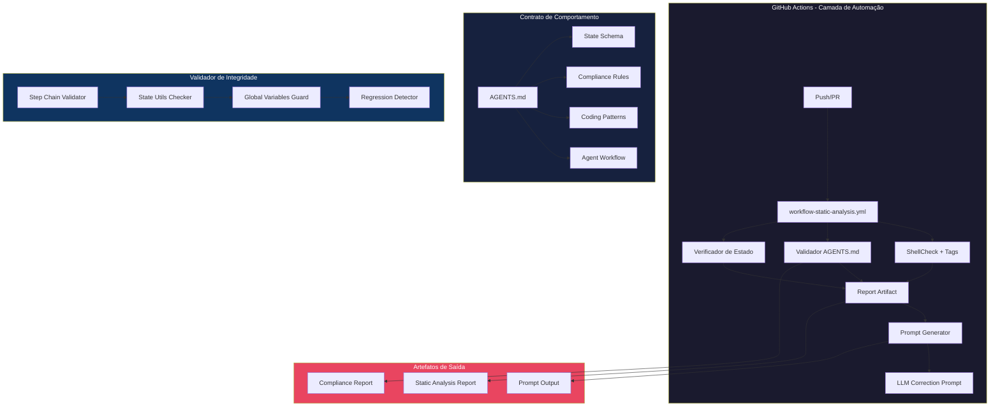

# Arquitetura do Ecossistema de Governança - build-iso

**Versão:** 1.0  
**Data:** 2026-02-15  
**Status:** Proposta para Aprovação  

---

## 1. Visão Geral

Este documento define a arquitetura completa do ecossistema de governança técnica para o projeto build-iso. O ecossistema é composto por quatro componentes principais que trabalham em conjunto para garantir qualidade, consistência e proteção contra regressões:

1. **Workflow de Análise Estática** - GitHub Actions para validação contínua
2. **Gerador de Prompts** - Camada de abstração para correção direcionada
3. **Contrato AGENTS.md** - Regras obrigatórias para agentes LLM
4. **Validador de Integridade** - Proteção contra regressões funcionais

---

## 2. Diagrama de Arquitetura



---

## 3. Componente 1: Workflow de Análise Estática

### 3.1 Arquivo: `.github/workflows/static-analysis.yml`

```yaml
name: Static Analysis & Governance

on:
  push:
    branches: [main, master, develop]
    paths:
      - '**.sh'
      - 'AGENTS.md'
      - '.github/workflows/static-analysis.yml'
  pull_request:
    paths:
      - '**.sh'
      - 'AGENTS.md'
  workflow_dispatch:

jobs:
  shellcheck:
    name: ShellCheck + Semantic Tags
    runs-on: ubuntu-latest
    steps:
      - uses: actions/checkout@v4
      
      - name: Run ShellCheck with JSON output
        uses: ludizm/shellcheck-action@v1
        with:
          severity: warning
          format: json
          output: output/shellcheck-results.json
      
      - name: Validate semantic tags
        run: |
          bash scripts/validate-semantic-tags.sh \
            --input output/shellcheck-results.json \
            --protocol docs/COMMENT_PROTOCOL_PDS_BASH.md \
            --output output/tag-validation.json
      
      - name: Upload analysis results
        uses: actions/upload-artifact@v4
        with:
          name: static-analysis-results
          path: output/*.json
          retention-days: 30

  agents-contract:
    name: AGENTS.md Contract Validation
    runs-on: ubuntu-latest
    steps:
      - uses: actions/checkout@v4
      
      - name: Validate AGENTS.md schema
        run: |
          bash scripts/validate-agents-contract.sh \
            --agents-file AGENTS.md \
            --output output/contract-validation.json
      
      - name: Check state schema consistency
        run: |
          bash scripts/validate-state-schema.sh \
            --state-lib config-overrides/.../state-utils.sh \
            --schema-ref docs/STATE_SCHEMA.md \
            --output output/state-validation.json

  integrity-check:
    name: Installer Integrity Check
    runs-on: ubuntu-latest
    steps:
      - uses: actions/checkout@v4
      
      - name: Validate step chain
        run: |
          bash scripts/validate-step-chain.sh \
            --installer config-overrides/.../installer \
            --steps-dir config-overrides/.../steps \
            --output output/step-chain.json
      
      - name: Check forbidden patterns
        run: |
          bash scripts/check-forbidden-patterns.sh \
            --paths config-overrides \
            --output output/forbidden-patterns.json

  prompt-generator:
    name: Generate LLM Correction Prompts
    needs: [shellcheck, agents-contract, integrity-check]
    runs-on: ubuntu-latest
    if: always()
    steps:
      - uses: actions/checkout@v4
      
      - name: Download all artifacts
        uses: actions/download-artifact@v4
        with:
          path: output/
      
      - name: Generate correction prompts
        run: |
          python3 scripts/generate-llm-prompts.py \
            --analysis-dir output/ \
            --template .github/prompts/correction-template.md \
            --output output/llm-prompts/
      
      - name: Upload prompts
        uses: actions/upload-artifact@v4
        with:
          name: llm-prompts
          path: output/llm-prompts/
          retention-days: 7
```

### 3.2 Script de Validação de Tags Semânticas

**Arquivo:** `scripts/validate-semantic-tags.sh`

| Parâmetro | Descrição |
|---|---|
| `--input` | Output JSON do ShellCheck |
| `--protocol` | Arquivo de referência do protocolo PDS-Bash |
| `--output` | Arquivo JSON com resultados da validação |

**Regras de Validação:**

1. Todo bloco lógico deve ter `@ID` único
2. Referências `@REQ` devem apontar para IDs existentes
3. Referências `@FAIL` devem apontar para IDs existentes
4. Blocos com `@ID` devem ter `@STEP` correspondente

### 3.3 Script de Geração de Prompts

**Arquivo:** `scripts/generate-llm-prompts.py`

Gera prompts estruturados para agentes LLM com base nos resultados da análise estática.

---

## 4. Componente 2: Gerador de Prompts Estruturados

### 4.1 Template de Prompt

**Arquivo:** `.github/prompts/correction-template.md`

```markdown
---
description: Prompt de correção gerado automaticamente após análise estática
---

# Análise de Código: {{filename}}

## Contexto do Projeto

- **Projeto:** build-iso (Debian + ZFS-on-root + ZFSBootMenu)
- **Arquivo:** {{filepath}}
- **Linha:** {{line_number}}
- **Severidade:** {{severity}}

## Problema Identificado

```
{{shellcheck_message}}
```

## Regras Aplicáveis

### do AGENTS.md

{{applicable_agents_rules}}

### do Protocolo PDS-Bash

{{applicable_protocol_rules}}

## Código Afetado

```bash
{{code_snippet}}
```

## Correção Sugerida

{{correction_suggestion}}

## Contexto Adicional

- **Tags semânticas no arquivo:** {{semantic_tags_count}}
- **Conformidade com protocolo:** {{protocol_compliance_status}}
- **Variáveis globais usadas:** {{global_variables}}

## Instruções para o Agente

1. Aplique a correção indicada
2. Verifique se não introduziu novos problemas
3. Atualize as tags semânticas se necessário
4. Execute localmente: `shellcheck {{filepath}}`
```

### 4.2 Categorias de Prompts

| Categoria | Gatilho | Ação Requerida |
|---|---|---|
| `shellcheck-error` | ShellCheck falha | Corrigir erro de sintaxe/shell |
| `shellcheck-warning` | ShellCheck warning | Revisar e corrigir se necessário |
| `tag-missing` | Tag obrigatória ausente | Adicionar tag conforme protocolo |
| `tag-invalid` | Tag com referência inválida | Corrigir referência |
| `contract-violation` | Regra AGENTS.md violada | Ajustar código |
| `step-chain-broken` | Cadeia de steps quebrada | Verificar fluxo |
| `forbidden-pattern` | Padrão proibido detectado | Remover padrão |

---

## 5. Componente 3: Contrato AGENTS.md Aprimorado

### 5.1 Estrutura do Contrato

O AGENTS.md será expandido para incluir:

```markdown
# CONTRATO DE COMPORTAMENTO - AGENTS.md

## 1. Dicionário de Estado (State Schema)

### Variáveis de Estado do Instalador

| Variável | Tipo | Descrição | Obrigatório |
|---|---|---|---|
| `CURRENT_STEP` | string | ID do step atual | Sim |
| `NEXT_STEP` | string | ID do próximo step | Sim |
| `PREV_STEP` | string | ID do step anterior | Sim |
| `STATE_FILE` | string | Caminho do arquivo de estado | Sim |
| `INSTALL_PROFILE` | string | Perfil de instalação | Não |

### Tags de Estado Obrigatórias

| Tag | Uso | Exemplo |
|---|---|---|
| `@INST_STATE` | Variáveis de estado lidas | `@INST_STATE: CURRENT_STEP, STATE_FILE` |
| `@INST_DEP` | Dependências do step | `@INST_DEP: state-utils.sh, ui-utils.sh` |

## 2. Regras de Ouro (Compliance)

### Regras de Segurança

- ✅ Nunca hardcode senhas ou chaves
- ✅ Sempre use `set -euo pipefail`
- ✅ Valide caminhos de dispositivo antes de usar
- ✅ Confirme operações destrutivas

### Regras de Estado

- ✅ Use `state_kv_set`/`state_kv_get` para persistência
- ✅ Não use variáveis globais para estado
- ✅ Serialize estado ao final de cada step
- ✅ Use `trap` para cleanup em caso de falha

### Regras de Tags

- ✅ Use `@ID` + `@STEP` para todos os blocos lógicos
- ✅ Use `@REQ` para dependências entre blocos
- ✅ Use `@FAIL` para caminhos de erro
- ✅ Use `@DATA` para contexto de I/O

## 3. Padrões de Codificação

### Padrões Obrigatórios

```bash
# Shebang correto
#!/usr/bin/env bash  # para bashisms
#!/bin/sh             # para POSIX

# Header com tags
# @ID: EXEMPLO_BLOCO
# @STEP: Descrição do objetivo
# @REQ: DEPENDENCIA_1, DEPENDENCIA_2
# @FAIL: TRATAMENTO_ERRO
# @DATA: IN /path/input, OUT /path/output

# Tratamento de erros
set -euo pipefail

# Funções com prefixo语义
verbo_objeto() {
    local param1="${1-}"
    # implementação
}
```

### Anti-Padrões Proibidos

```bash
# ❌ NÃO USE
PASSWORD="hardcoded"           # Senha hardcoded
rm -rf $DEVICE                  # Sem verificação
source "$FILE"                  # Sem validação
eval "$COMMAND"                 # Shell injection risk
```

## 4. Fluxo de Trabalho para Agentes

### Ciclo de Vida de uma Mudança

```
1. Analisar contexto
   └─> Ler AGENTS.md
   └─> Verificar STATE_SCHEMA.md
   └─> Identificar tags relevantes

2. Implementar mudança
   └─> Criar/adicionar @ID + @STEP
   └─> Adicionar @REQ se necessário
   └─> Adicionar @FAIL para tratamento de erro

3. Validar conformidade
   └─> Executar: make verify-comment-contract
   └─> Executar: make lint
   └─> Verificar: shellcheck

4. Comitar com evidências
   └─> Incluir output das validações
   └─> Documentar decisão de design
```

---

## 6. Componente 4: Validação de Integridade

### 6.1 Scripts de Validação

#### 6.1.1 Validador de Cadeia de Steps

**Arquivo:** `scripts/validate-step-chain.sh`

Verifica se a cadeia de steps do instalador está consistente.

```bash
# Uso
./scripts/validate-step-chain.sh \
  --installer config-overrides/.../installer \
  --steps-dir config-overrides/.../steps \
  --output output/step-chain.json
```

**Validações:**

1. Todos os steps referenciados existem
2. Não há ciclos na cadeia
3. Cada step tem handler válido
4. Dependências estão satisfeitos

#### 6.1.2 Verificador de Variáveis Globais

**Arquivo:** `scripts/check-forbidden-patterns.sh`

Detecta padrões proibidos no código.

```bash
# Uso
./scripts/check-forbidden-patterns.sh \
  --paths config-overrides \
  --output output/forbidden-patterns.json
```

**Padrões Proibidos:**

| Padrão | Descrição | Severidade |
|---|---|---|
| `hardcoded-password` | Senha hardcoded | CRITICAL |
| `hardcoded-key` | Chave de criptografia | CRITICAL |
| `unsafe-rm` | `rm -rf` sem verificação | ERROR |
| `eval-usage` | `eval` sem sanitização | WARNING |
| `source-without-check` | `source` sem validação | WARNING |

#### 6.1.3 Validador de State Utils

**Arquivo:** `scripts/validate-state-schema.sh`

Verifica uso correto das funções de estado.

```bash
# Uso
./scripts/validate-state-schema.sh \
  --state-lib config-overrides/.../state-utils.sh \
  --schema-ref docs/STATE_SCHEMA.md \
  --output output/state-validation.json
```

**Validações:**

1. Todas as funções de estado são usadas corretamente
2. Variáveis de estado seguem o schema
3. Não há vazamento de estado entre steps
4. Persistência está funcionando

---

## 7. Estrutura de Arquivos Proposta

```
build-iso/
├── .github/
│   ├── workflows/
│   │   ├── static-analysis.yml      # NOVO: Workflow principal
│   │   ├── lint.yml                  #现有的
│   │   └── build.yml                 #现有的
│   ├── prompts/
│   │   ├── correction-template.md    # NOVO: Template de prompt
│   │   └── opsx-*.md                 #现有的
│   └── skills/
│       └── openspec-*/               #现有的
├── scripts/
│   ├── validate-semantic-tags.sh     # NOVO: Validador de tags
│   ├── validate-agents-contract.sh   # NOVO: Validador AGENTS.md
│   ├── validate-state-schema.sh      # NOVO: Validador de estado
│   ├── validate-step-chain.sh        # NOVO: Validador de steps
│   ├── check-forbidden-patterns.sh   # NOVO: Detector de anti-padrões
│   ├── generate-llm-prompts.py       # NOVO: Gerador de prompts
│   └── ... (现有的)
├── docs/
│   ├── STATE_SCHEMA.md               # NOVO: Schema de estado
│   ├── COMMENT_PROTOCOL_PDS_BASH.md  #现有的
│   └── ... (现有的)
├── tests/
│   ├── test-comment-contract.sh      #现有的
│   ├── test-semantic-tags.sh         # NOVO: Teste de tags
│   └── ... (现有的)
└── output/                           # Gerado automaticamente
    ├── shellcheck-results.json
    ├── tag-validation.json
    ├── contract-validation.json
    ├── state-validation.json
    ├── step-chain.json
    ├── forbidden-patterns.json
    └── llm-prompts/
```

---

## 8. Integração com Makefile

Adicionar novos alvos ao Makefile existente:

```makefile
# === GOVERNANCE ===

.PHONY: verify-contract
verify-contract: ## Valida conformidade com AGENTS.md
	@bash scripts/validate-agents-contract.sh \
		--agents-file AGENTS.md \
		--output output/contract-validation.json
	@echo "Contract validation: output/contract-validation.json"

.PHONY: verify-tags
verify-tags: ## Valida tags semânticas PDS-Bash
	@bash scripts/validate-semantic-tags.sh \
		--protocol docs/COMMENT_PROTOCOL_PDS_BASH.md \
		--output output/tag-validation.json
	@echo "Tag validation: output/tag-validation.json"

.PHONY: verify-state
verify-state: ## Valida schema de estado
	@bash scripts/validate-state-schema.sh \
		--state-lib config-overrides/.../state-utils.sh \
		--schema-ref docs/STATE_SCHEMA.md \
		--output output/state-validation.json
	@echo "State validation: output/state-validation.json"

.PHONY: verify-integrity
verify-integrity: ## Valida integridade do instalador
	@bash scripts/validate-step-chain.sh \
		--installer config-overrides/.../installer \
		--steps-dir config-overrides/.../steps \
		--output output/step-chain.json
	@bash scripts/check-forbidden-patterns.sh \
		--paths config-overrides \
		--output output/forbidden-patterns.json
	@echo "Integrity check: output/step-chain.json, output/forbidden-patterns.json"

.PHONY: generate-prompts
generate-prompts: ## Gera prompts de correção para LLM
	@python3 scripts/generate-llm-prompts.py \
		--analysis-dir output/ \
		--template .github/prompts/correction-template.md \
		--output output/llm-prompts/
	@echo "LLM prompts: output/llm-prompts/"

.PHONY: governance-all
governance-all: verify-contract verify-tags verify-state verify-integrity generate-prompts
	@echo "Governance validation complete!"
```

---

## 9. Fluxo de Dados

```mermaid
sequenceDiagram
    participant Dev as Desenvolvedor
    participant GH as GitHub Actions
    participant Scripts as Scripts de Validação
    participant LLM as Agente LLM
    
    Dev->>GH: Push ou PR com mudanças
    GH->>Scripts: Executa pipeline de análise
    
    rect rgb(40, 40, 60)
        Note over Scripts: Análise Estática
        Scripts->>Scripts: ShellCheck
        Scripts->>Scripts: Validador de Tags
        Scripts->>Scripts: Validador AGENTS.md
        Scripts->>Scripts: Verificador de Integridade
    end
    
    Scripts->>GH: Gera artefatos JSON
    GH->>LLM: Prompt de correção estruturado
    
    LLM->>Dev: Retorna código corrigido
    Dev->>GH: Nova versão com correções
    
    GH->>Scripts: Re-valida
    Scripts->>GH: Validação passa
    GH->>Dev: PR aprovado
```



---

## 10. Benefícios Esperados

| Benefício | Descrição |
|---|---|
| **Redução de Erros** | Detecção automática de problemas antes da fusão |
| **Consistência** | Tags semânticas padronizadas em todo o código |
| **Governança** | Regras obrigatórias documentadas e verificadas |
| **Recuperabilidade** | Prompts estruturados para correção rápida |
| **Documentação** | Validações geram evidências de conformidade |

---

## 11. Próximos Passos (após aprovação)

1. Criar scripts de validação em `scripts/`
2. Adicionar workflow `.github/workflows/static-analysis.yml`
3. Criar template de prompt em `.github/prompts/`
4. Criar `docs/STATE_SCHEMA.md`
5. Atualizar `AGENTS.md` com seção de contrato
6. Adicionar alvos ao Makefile
7. Testar pipeline completo
8. Documentar uso no `docs/`

---

**Nota:** Este documento é uma proposta para aprovação. A implementação será feita em modo Code após validação pelo usuário.
