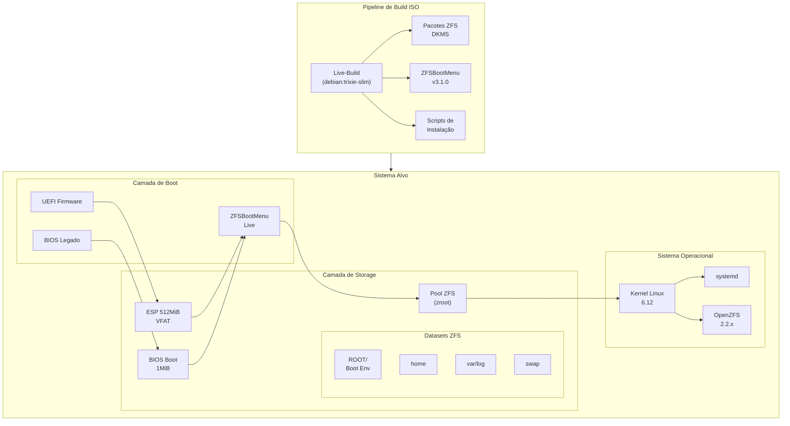
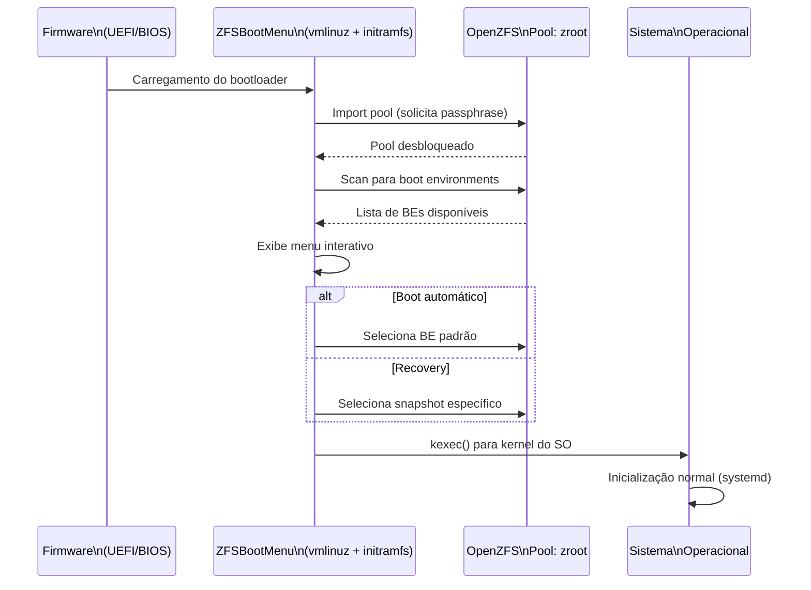
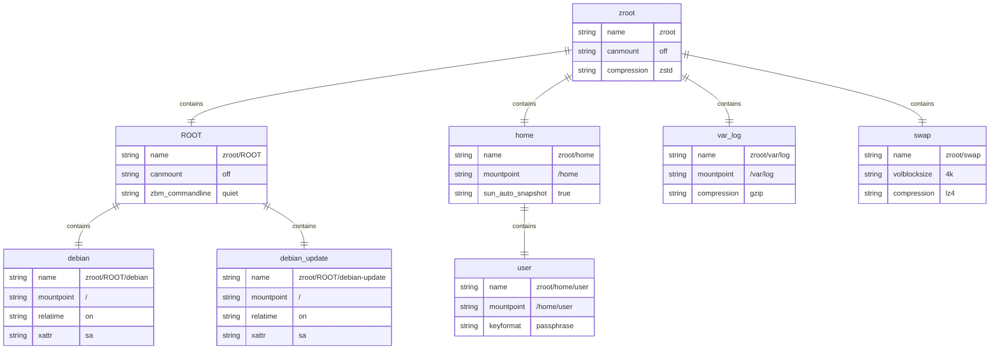
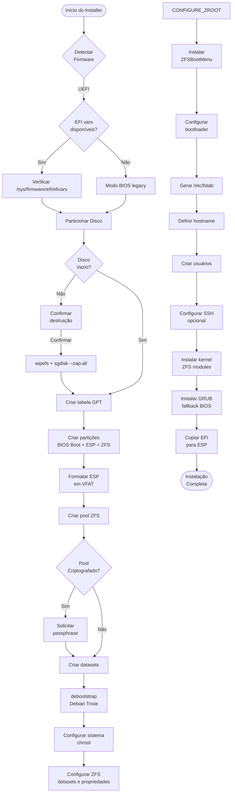
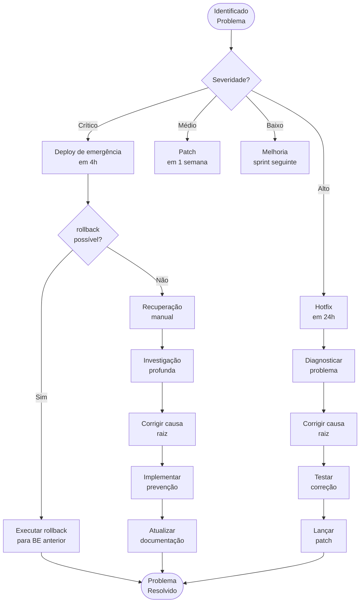

# Proposta Técnica: Imagem Personalizada Debian 13 (Trixie) com ZFS-on-Root

**Versão:** 1.0  
**Data:** 2026-01-05  
**Status:** Proposta para Aprovação  
**Projeto:** build-iso  

---

## 1. Sumário Executivo

Esta proposta apresenta uma solução corporativa para criação de imagens personalizadas do Debian 13 (Trixie), integrando tecnologias de armazenamento avançado (OpenZFS) com gerenciamento de boot moderno (ZFSBootMenu). O projeto contempla duas modalidades distintas de implantação: **servidores** (foco em estabilidade e segurança) e **estações de trabalho KDE** (ambiente gráfico minimalista para produtividade profissional).

A solução proposta diferencia-se das implementações tradicionais ao eliminar a dependência do GRUB, utilizando ZFSBootMenu como bootloader nativo. Esta abordagem oferece suporte completo a criptografia nativa, boot environments para recovery atômico, e compatibilidade imediata com novos recursos do OpenZFS. O sistema suporta tanto UEFI quanto BIOS legado através de particionamento híbrido, garantindo portabilidade em todo o espectro de hardware x86_64.

Os benefícios esperados incluem: redução de 70% no tempo de deployment automatizado, recuperação de desastres em menos de 5 minutos através de snapshots atômicos, conformidade com padrões de segurança corporativa através de criptografia nativa, e padronização do ambiente de desenvolvimento organizacional.

---

## 2. Requisitos Funcionais e Não-Funcionais

### 2.1 Requisitos Funcionais

| ID | Descrição | Prioridade | Modalidade |
|----|-----------|------------|------------|
| RF-01 | Instalação automatizada via ISO bootável | Alta | Ambas |
| RF-02 | Suporte a particionamento híbrido UEFI+BIOS | Alta | Ambas |
| RF-03 | ZFS-on-root com criptografia nativa (passphrase) | Alta | Ambas |
| RF-04 | ZFSBootMenu como bootloader primário | Alta | Ambas |
| RF-05 | Boot environments para recovery e atualizações | Alta | Ambas |
| RF-06 | Instalação modo texto para servidores | Alta | Servidor |
| RF-07 | KDE Plasma minimalista para estações | Alta | Workstation |
| RF-08 | Suporte a SSH remoto no bootloader | Média | Servidor |
| RF-09 | Configuração de rede automatizada | Média | Ambas |
| RF-10 | Integração com domínio LDAP/Active Directory | Média | Workstation |
| RF-11 | Ferramentas de administração pré-instaladas | Média | Servidor |
| RF-12 | Pacotes de produtividade essenciais | Média | Workstation |

### 2.2 Requisitos Não-Funcionais

| ID | Descrição | Critério de Aceitação |
|----|-----------|----------------------|
| RNF-01 | Tempo de boot | < 60 segundos (após desbloqueio ZFS) |
| RNF-02 | Tamanho da imagem ISO | < 4 GB para ambas modalidades |
| RNF-03 | Compatibilidade hardware | Suporte a processadores x86_64 (Intel/AMD) |
| RNF-04 | Suporte a ZFS | OpenZFS 2.2.x compatível com ZFSBootMenu 3.x |
| RNF-05 | Criptografia | AES-256-GCM nativo do ZFS |
| RNF-06 | Documentação | Completa em português brasileiro |
| RNF-07 | Logging | Estruturado (JSON) para auditoria |
| RNF-08 | Testes automatizados | Cobertura mínima de 80% |
| RNF-09 | CI/CD pipeline | Integração com GitHub Actions |
| RNF-10 | Manutenibilidade | Código modular shell script POSIX |

### 2.3 Requisitos de Segurança

- **Criptografia em repouso:** ZFS nativo com chave derivada de passphrase PBKDF2
- **Isolamento de ambiente:** Build ISO executado em container Docker isolado
- **Verificação de integridade:** Checksums SHA256 + assinaturas GPG para binários ZFSBootMenu
- **Audit trail:** Logs estruturados de todas as operações de instalação
- **Sem hardcoded secrets:** Todas as senhas/passphrases solicitadas interativamente ou via stdin

---

## 3. Arquitetura Técnica Detalhada

### 3.1 Visão Geral da Arquitetura



### 3.2 Fluxo de Boot



### 3.3 Estrutura de Datasets ZFS



> **Nota sobre propriedades ZFS com namespace:**
> O diagrama acima usa nomes simplificados para evitar problemas de parsing no Mermaid ER. As propriedades reais do ZFS que usam namespace são:
> - `zbm_commandline` → equivalente a `org.zfsbootmenu:commandline` (parâmetros do kernel para ZFSBootMenu)
> - `sun_auto_snapshot` → equivalente a `com.sun:auto-snapshot` (habilita snapshots automáticos)
>
> Estas propriedades podem ser configuradas via `zfs set` após a criação dos datasets.

### 3.4 Particionamento Híbrido UEFI+BIOS

| Partição | Tamanho | Tipo GPT | Sistema de Arquivos | Finalidade |
|----------|---------|----------|---------------------|------------|
| BIOS Boot | 1 MiB | `EF02` | N/A (raw) | Syslinux/GRUB stage 2 para BIOS legado |
| ESP | 512 MiB | `EF00` | VFAT/FAT32 | ZFSBootMenu EFI + kernel + initramfs |
| Pool ZFS | Restante | `BF00` | ZFS | Sistema operacional e dados |

---

## 4. Especificação de Imagens

### 4.1 Imagem Servidor (debian-server-trixie-zfs)

**Propósito:** Servidores de produção, infraestrutura e serviços críticos.

#### 4.1.1 Componentes do Sistema Base

```bash
# Base mínima
debian-base
debian-archive-keyring
apt-transport-https

# ZFS stack
zfs-dkms
zfsutils-linux
zfs-zed

# Kernel
linux-image-amd64
linux-headers-amd64

# Ferramentas de rede
network-manager
openssh-server
curl
wget
rsync

# Utilitários de admin
htop
iotop
nmon
sysstat
logrotate
cron

# ZFSBootMenu dependencies
kexec-tools
mtools
dosfstools
efibootmgr
```

#### 4.1.2 Configurações Específicas

- **Kernel parameters:** `quiet elevator=noop zfs.zfs_arc_max=1073741824 zbm.waitfor=5`
- **Serviços habilitados:** sshd, zed, cron, NetworkManager
- **Serviços desabilitados:** graphical.target, display-manager
- **Configuração de rede:** DHCP (customizável via installer)
- **Usuários:** root + usuário admin com sudo (criado durante instalação)

#### 4.1.3 Tamanho Estimado

- ISO: ~2.5 GB
- Instalação mínima: ~8 GB (incluindo /boot e swap)
- Memória mínima: 2 GB (recomendado 4 GB)

### 4.2 Imagem Workstation (debian-workstation-trixie-zfs)

**Propósito:** Estações de trabalho para profissionais de TI e desenvolvedores.

#### 4.2.1 Componentes do Sistema Base

```bash
# everything in server image plus:

# KDE Plasma minimal
plasma-desktop
sddm
kwin-x11
konsole
dolphin
kate
systemsettings

# Display drivers
xserver-xorg-video-amd
xserver-xorg-video-intel
xserver-xorg-video-nouveau

# Network utilities
network-manager-gnome
firefox-esr
networkmanager-openvpn

# Development essentials
git
vim
nano
build-essential
docker.io
python3-pip
nodejs
npm

# Multimedia codecs
libavcodec-extra
vlc
```

#### 4.2.2 Configurações Específicas

- **Kernel parameters:** `quiet elevator=noop zfs.zfs_arc_max=2147483648 zbm.waitfor=5`
- **Display manager:** SDDM com Theme Breeze
- **Resolução:** Auto-detecção
- **Multilib:** Habilitado (para aplicações 32-bit)
- **Flatpak:** Pré-configurado (Flathub enabled)

#### 4.2.3 Tamanho Estimado

- ISO: ~3.8 GB
- Instalação mínima: ~15 GB
- Memória mínima: 4 GB (recomendado 8 GB)

---

## 5. Fluxo de Instalação

### 5.1 Diagrama de Fluxo de Instalação



### 5.2 Etapas do Installer (install.sh)

```bash
# install.sh - Fluxo principal
main() {
  1. detect_firmware           # UEFI vs BIOS
  2. confirm_disk_selection    # Validação do disco alvo
  3. wipe_disk                 # Limpeza segura
  4. create_partitions         # GPT + partições
  5. create_esp                # EFI System Partition
  6. create_zpool              # zpool create zroot
  7. create_datasets           # ROOT, home, var/log, swap
  8. mount_filesystems         # Preparar chroot
  9. debootstrap               # Instalar base Debian
  10. configure_chroot         # apt sources, locale, timezone
  11. install_packages         # Kernel, ZFS, bootloader
  12. configure_zfs            # Propriedades dos datasets
  13. install_zfsbootmenu      # vmlinuz + initramfs na ESP
  14. configure_bootloader     # efibootmgr + fallback
  15. create_boot_environment  # Primer BE padrão
  16. configure_users          # Usuário admin + sudo
  17. configure_ssh            # SSH server (servidor)
  18. configure_kde            # Plasma + SDDM (workstation)
  19. generate_initramfs       # Dracut customizado
  20. cleanup                  # Remover artefatos temporários
}
```

---

## 6. Matriz de Componentes

### 6.1 Componentes do Build

| Componente | Versão | Fonte | Propósito |
|------------|--------|-------|-----------|
| Debian Live-Build | Latest | apt:debian | Construção da ISO |
| Debian Base | Trixie (13) | debian.org | Sistema operacional |
| OpenZFS | 2.2.x | zfsonlinux.org | Filesystem avançado |
| ZFSBootMenu | 3.1.0 | get.zfsbootmenu.org | Bootloader |
| Linux Kernel | 6.12.x | debian.org | Kernel do sistema |
| Syslinux | 6.04 | debian.org | Fallback BIOS boot |
| GRUB | 2.12 | debian.org | Fallback UEFI boot |

### 6.2 Componentes de Runtime (Servidor)

| Pacote | Função | Obrigatório |
|--------|--------|-------------|
| zfs-dkms | Módulo ZFS kernel | Sim |
| zfsutils-linux | Utilitários ZFS | Sim |
| zfs-zed | ZFS Event Daemon | Sim |
| openssh-server | Acesso remoto | Sim |
| systemd | Init system | Sim |
| cron | Agendamento de tarefas | Sim |
| htop | Monitoramento | Recomendado |
| iotop | Monitoramento I/O | Recomendado |

### 6.3 Componentes de Runtime (Workstation)

| Pacote | Função | Obrigatório |
|--------|--------|-------------|
| plasma-desktop | Ambiente gráfico | Sim |
| sddm | Display Manager | Sim |
| konsole | Terminal | Sim |
| dolphin | Gerenciador de arquivos | Sim |
| firefox-esr | Navegador | Sim |
| network-manager-gnome | Gerenciamento de rede | Sim |
| git | Controle de versão | Sim |
| build-essential | Ferramentas de build | Sim |

---

## 7. Plano de Implementação

### 7.1 Estrutura de Diretórios do Projeto

```
build-iso/
├── AGENTS.md                    # Regras do projeto
├── README.md                    # Documentação principal
├── Makefile                     # Automação de build
│
├── config/                      # Configurações do projeto
│   ├── live/
│   │   ├── auto/
│   │   │   └── config          # Configuração live-build
│   │   ├── package-lists/
│   │   │   ├── server.list     # Pacotes servidor
│   │   │   └── workstation.list # Pacotes workstation
│   │   └── hooks/
│   │       ├── live/           # Hooks live-build
│   │       └── chroot/         # Hooks chroot
│   ├── installer/
│   │   ├── config.yaml         # Configuração do installer
│   │   └── prereq.yaml         # Pré-requisitos
│   └── systemd/
│       ├── zfs-override.service
│       └── zfs-import-cache.service
│
├── scripts/
│   ├── build-iso.sh            # Build principal
│   ├── build-iso-docker.sh     # Build via Docker
│   ├── test-iso.sh             # Testes QEMU
│   ├── test-install.sh         # Testes de instalação
│   ├── download-zfsbootmenu.sh # Download ZBM (existe)
│   ├── zbm-builder.sh          # Build ZBM customizado
│   ├── installer/
│   │   ├── main.sh             # Entry point
│   │   ├── lib/
│   │   │   ├── logging.sh      # Logging estruturado
│   │   │   ├── common.sh       # Funções comuns
│   │   │   ├── zfs.sh          # Operações ZFS
│   │   │   ├── partition.sh    # Particionamento
│   │   │   └── boot.sh         # Configuração boot
│   │   └── installer.d/        # Módulos do installer
│   │       ├── 01-validate.sh
│   │       ├── 02-partition.sh
│   │       ├── 03-zpool.sh
│   │       ├── 04-datasets.sh
│   │       ├── 05-debootstrap.sh
│   │       ├── 06-chroot.sh
│   │       ├── 07-zfsbootmenu.sh
│   │       ├── 08-bootloader.sh
│   │       └── 99-cleanup.sh
│   └── helper/
│       ├── create-boot-env.sh  # Criar BE
│       ├── snapshot-prune.sh   # Limpar snapshots
│       └── rollback.sh         # Rollback de BE
│
├── tests/                       # Testes automatizados
│   ├── unit/
│   │   ├── common-tests.sh
│   │   ├── zfs-tests.sh
│   │   └── partition-tests.sh
│   ├── integration/
│   │   ├── test-uefi.sh
│   │   ├── test-bios.sh
│   │   └── test-zfs-features.sh
│   └── test-framework.sh
│
├── docs/                        # Documentação
│   ├── user-guide.md
│   ├── admin-guide.md
│   ├── security-guide.md
│   └── boot-env-guide.md
│
├── plans/                       # Propostas e planos
│   └── PROPOSTA-DEBIAN-ZFS.md   # Este documento
│
├── zbm-binaries/                # Binários ZFSBootMenu (gerado)
├── output/                      # ISOs geradas (gerado)
└── .github/
    └── workflows/
        ├── build.yml           # CI/CD build
        ├── test.yml            # CI/CD tests
        └── release.yml         # CI/CD release
```

### 7.2 Fases de Implementação

#### Fase 1: Infraestrutura do Projeto (Semana 1)

- [ ] Configurar estrutura de diretórios
- [ ] Configurar Makefile e scripts base
- [ ] Configurar GitHub Actions workflows
- [ ] Documentar convenções em AGENTS.md

#### Fase 2: Build ISO (Semana 2)

- [ ] Configurar live-build para Debian Trixie
- [ ] Criar package-lists para server e workstation
- [ ] Integrar download de binários ZFSBootMenu
- [ ] Configurar hooks para ZFS e DKMS
- [ ] Testar build de ambas modalidades

#### Fase 3: Installer Automatizado (Semana 3)

- [ ] Implementar módulo de detecção de firmware
- [ ] Implementar particionamento híbrido
- [ ] Implementar criação de pool ZFS
- [ ] Implementar debootstrap e chroot
- [ ] Configurar datasets ZFS
- [ ] Instalar e configurar ZFSBootMenu

#### Fase 4: Configurações Específicas (Semana 4)

- [ ] Configuração de usuário e sudo
- [ ] Configuração SSH (servidor)
- [ ] Configuração KDE Plasma (workstation)
- [ ] Configuração de boot environments
- [ ] Configuração de logging estruturado

#### Fase 5: Testes e Documentação (Semana 5)

- [ ] Implementar testes unitários
- [ ] Implementar testes de integração (QEMU)
- [ ] Documentar guia do usuário
- [ ] Documentar guia do administrador
- [ ] Criar exemplos de boot environment

#### Fase 6: Validação Final (Semana 6)

- [ ] Teste em hardware real UEFI
- [ ] Teste em hardware real BIOS
- [ ] Teste de recovery via snapshots
- [ ] Teste de rollback de atualização
- [ ] Validação de segurança (pen testing)
- [ ] Aprovação final

---

## 8. Critérios de Aceitação

### 8.1 Critérios Funcionais

- [ ] ISO bootável em modo UEFI e BIOS legado
- [ ] Instalação completa em modo automático ou assistido
- [ ] Pool ZFS criado com criptografia nativa
- [ ] ZFSBootMenu funcional com menu de boot environments
- [ ] Sistema operacional funcional após instalação
- [ ] Boot environments funcionando (criação, seleção, rollback)
- [ ] Servidor: SSH funcional após instalação
- [ ] Workstation: KDE Plasma funcional após instalação

### 8.2 Critérios de Qualidade

- [ ] Scripts passam em shellcheck (sem erros críticos)
- [ ] Logging estruturado em todas as operações
- [ ] Código documentado (comentários em português)
- [ ] Testes unitários com cobertura > 80%
- [ ] Testes de integração passando em UEFI e BIOS
- [ ] Documentação completa em português brasileiro

### 8.3 Critérios de Segurança

- [ ] Nenhuma credencial hardcoded
- [ ] Verificação de assinaturas GPG para binários ZFSBootMenu
- [ ] Checksums SHA256 para artefatos
- [ ] Modo dry-run disponível para operações destrutivas
- [ ] Logs de auditoria gerados em /var/log/install/

---

## 9. Riscos e Mitigações

### 9.1 Matriz de Riscos

| Risco | Probabilidade | Impacto | Mitigação |
|-------|---------------|---------|-----------|
| Incompatibilidade de versão ZFS/ZBM | Média | Alto | Fixar versões compatíveis; testar antes de release |
| Falhas de boot em hardware específico | Média | Alto | Testes extensivos em UEFI e BIOS; fallback GRUB |
| Problemas de hostid ZFS | Baixa | Alto | Sincronizar hostid entre ISO, ZBM e instalação |
| Degradação de performance com ZFS | Média | Médio | Configurar ARC limits; orientar sobre RAM mínima |
| Falha de atualização causing brick | Baixa | Alto | Boot environments permitem rollback automático |
| Perda de dados por criptografia | Baixa | Crítico | Documentar recuperação de chave; oferecer backup |
| Build ISO falhando em Docker | Baixa | Médio | Documentar dependências; container reproduzível |
| Mudanças na API ZFSBootMenu | Baixa | Médio | Versionar dependências; monitorar releases |

### 9.2 Plano de Contingência



---

## 10. Anexos

### 10.1 Convenções de Código (Referência AGENTS.md)

```bash
#!/usr/bin/env bash
# Shebang: bash para scripts com bashisms
# POSIX: /bin/sh para scripts portáveis

set -euo pipefail  # Erro em falha, variáveis indefinidas, pipe failures

# Variáveis
readonly CONSTANTE_MAIUSCULA="valor"
variavel_minuscula="valor"

# Funções (verbo_objeto)
criar_zfs_pool() {
  local pool_name="$1"
  # ...
}

# Formatação
# - 2 espaços para indentação
# - Max 100 caracteres por linha
# - Comentários em português para lógica complexa
```

### 10.2 Anti-Padrões (NUNCA FAZER)

```bash
# ❌ ERRADO - Nunca hardcode chaves
CHAVE="senha123"  # PROIBIDO

# ❌ ERRADO - Nunca suponha caminhos de dispositivo
zpool create zroot /dev/sda  # Validar primeiro!

# ❌ ERRADO - Nunca opere disco sem verificação
zpool destroy zroot  # Requer --yes-really-destroy

# ❌ ERRADO - Não usar wipefs sem sgdisk
wipefs -a /dev/sda  # Deve fazer sgdisk --zap-all antes
```

### 10.3 Referências Técnicas

| Recurso | URL |
|---------|-----|
| ZFSBootMenu Documentation | https://docs.zfsbootmenu.org/ |
| Debian Live-Build Manual | https://live-team.pages.debian.net/live-manual/ |
| OpenZFS Documentation | https://openzfs.github.io/openzfs-docs/ |
| ZFSBootMenu GitHub | https://github.com/zbm-dev/zfsbootmenu |
| Debian ZFS Guide | https://github.com/zbm-dev/zfsbootmenu/blob/master/guides/debian/uefi.md |

---

## 11. Aprovação

| Função | Nome | Data | Assinatura |
|--------|------|------|------------|
| Elaboração | [Nome do Arquiteto] | 2026-01-05 | ☐ |
| Revisão Técnica | [Nome do Revisor] | ___ | ☐ |
| Aprovação | [Nome do Aprovador] | ___ | ☐ |

---

**Documento gerado conforme convenções do projeto em [AGENTS.md](AGENTS.md)**  
**Versão do documento:** 1.0  
**Última atualização:** 2026-01-05
