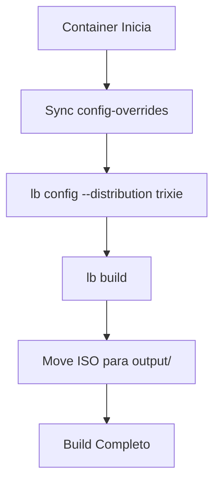

# 🐳 Docker Build Environment

Automação de construção de imagem ISO Debian com ZFS-on-root e ZFSBootMenu. O ambiente Docker fornece um ambiente isolado e reproduzível para o build da ISO.

---

## 📋 Interfaces Disponíveis

O projeto oferece duas formas de interagir com o ambiente Docker:

### 1. Via Makefile (Recomendado)

Todos os comandos centralizados no [`Makefile`](../Makefile):

```bash
# Build
make download-zbm    # Baixa binários do ZFSBootMenu
make setup-docker   # Constrói a imagem Docker do builder
make build-iso      # Inicia o build da ISO (executa container)

# Limpeza
make clean         # Remove artefatos de build e containers
```

Execute `make help` para ver todos os comandos disponíveis.

### 2. Via Docker Direto

Para uso direto ou automação customizada:

| Componente                       | Localização                    | Propósito                       |
| -------------------------------- | ------------------------------ | ------------------------------- |
| [`Dockerfile`](Dockerfile)       | `scripts/docker/Dockerfile`    | Imagem do builder Debian Trixie |
| [`entrypoint.sh`](entrypoint.sh) | `scripts/docker/entrypoint.sh` | Orquestra sync, config e build  |

---

## 🚀 Uso Rápido

```bash
# 1. Setup inicial
make download-zbm    # Baixa dependências do ZFSBootMenu
make setup-docker   # Constrói a imagem Docker

# 2. Build da ISO
make build-iso

# 3. Verificar artefatos gerados
ls -la output/
```

---

## 🏗️ Arquitetura do Container

O container Docker é construído a partir de `debian:trixie-slim` e inclui:

```
debian:trixie-slim
├── live-build         # Ferramentas de build ISO
├── debootstrap        # Bootstrap do sistema base
├── squashfs-tools    # Compressão squashfs
├── xorriso           # Geração de ISO
├── isolinux          # Boot BIOS legado
├── grub-efi-amd64   # Boot UEFI
├── zfsutils-linux    # Utilitários ZFS
├── dkms              # Compilação de módulos
├── linux-headers-amd64  # Headers para ZFS DKMS
├── build-essential  # Compiladores
└── gum              # Interface interativa (TTY)
```

### Fluxo de Execução



---

## 📁 Artefatos Gerados

Após o build, os seguintes artefatos são produzidos:

| Artefato    | Localização | Descrição                              |
| ----------- | ----------- | -------------------------------------- |
| `*.iso`     | `output/`   | Imagem ISO híbrida bootável            |
| `*.log`     | `logs/`     | Logs do processo de build              |
| `.contents` | `build/`    | Lista de pacotes incluídos             |
| `*.zsync`   | `build/`    | Metadados para atualização incremental |

---

## ⚙️ Configuração do Live-Build

A configuração do live-build é sincronizada de `config-overrides/` para o workspace:

```
config-overrides/
├── auto/              # Scripts de automação live-build
├── config/
│   ├── binary         # Configuração da imagem binária
│   ├── bootstrap      # Configuração do bootstrap
│   ├── chroot         # Configuração do chroot
│   └── hooks/         # Hooks de personalização
└── includes/
    ├── binary/        # Arquivos injetados na ISO
    └── chroot/        # Arquivos injetados no sistema
```

### Parâmetros de Configuração

| Parâmetro            | Valor                                     | Descrição                   |
| -------------------- | ----------------------------------------- | --------------------------- |
| `--distribution`     | `trixie`                                  | Versão Debian               |
| `--binary-images`    | `iso-hybrid`                              | ISO compatível UEFI+BIOS    |
| `--debian-installer` | `false`                                   | Sem installer Debian padrão |
| `--archive-areas`    | `main contrib non-free non-free-firmware` | Repositórios                |

---

## 🤖 Guia para Agentes LLM

### Verificação de Ambiente

```bash
# Verificar se imagem Docker existe
docker images | grep zbm-iso-builder

# Verificar se container anterior existe
docker ps -a | grep build-iso
```

### Limpeza de Ambiente Docker

```bash
# Remover containers órfãos
docker rm -f $(docker ps -aq --filter ancestor=zbm-iso-builder) 2>/dev/null || true

# Remover imagem antiga
docker rmi zbm-iso-builder 2>/dev/null || true

# Rebuild completo
make setup-docker
```

### Debug de Build

```bash
# Executar container em modo interativo
docker run -it --rm -v "$(pwd):/build" -w /build zbm-iso-builder bash

# Verificar logs de build
cat logs/live-build-*.log
```

---

## 📝 Referência de Comandos

### make setup-docker

Constrói a imagem Docker do builder:

- Base: `debian:trixie-slim`
- Tags: `zbm-iso-builder:latest`
- Tempo aproximado: 3-5 minutos

### make build-iso

Executa o build da ISO:

1. Sincroniza `config-overrides/` para workspace
2. Executa `lb config`
3. Executa `lb build`
4. Move artefatos para `output/`

### make clean

Limpa artefatos de build:

- Remove `live-build-workspace/`
- Remove `logs/`
- Remove `output/`
- Remove containers Docker

---

## ⚠️ Notas Técnicas

- **Memória:** Build requer mínimo 4GB RAM
- **Disk:** Build temporário requer ~20GB espaço
- **Tempo:** Build completo ~15-30 minutos
- **Rede:** Download de pacotes durante build
- **Permissões:** Usuário deve ter acesso ao Docker daemon

---

## 🔧 Solução de Problemas

| Problema               | Solução                                           |
| ---------------------- | ------------------------------------------------- |
| Build falha com espaço | Execute `make clean` antes de rebuild             |
| Container não inicia   | Verifique se Docker está rodando                  |
| Erro de permissão      | Adicione usuário ao grupo `docker`                |
| ISO não gerada         | Verifique logs em `logs/live-build-*.log`         |
| DKMS falha             | Verifique se `linux-headers-amd64` está instalado |

---

## 📦 Dependências do Build

### Pacotes Instalados no Container

| Categoria       | Pacotes                                                  |
| --------------- | -------------------------------------------------------- |
| **Build ISO**   | `live-build`, `debootstrap`, `squashfs-tools`, `xorriso` |
| **Bootloader**  | `isolinux`, `grub-efi-amd64`, `grub-pc-bin`, `mtools`    |
| **ZFS**         | `zfsutils-linux`, `dkms`, `linux-headers-amd64`          |
| **Utilitários** | `locales`, `gum`, `rsync`, `wget`                        |

---

## 🔗 Referências

- Debian Live-Build: https://live-team.pages.debian.net/live-manual/
- OpenZFS: https://openzfs.github.io/openzfs-docs/
- ZFSBootMenu: https://docs.zfsbootmenu.org/
